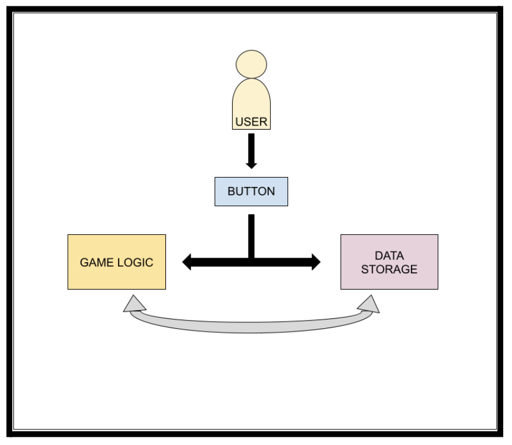

# Terrier Clicker (Auto Clicker Game)

## Members:
| **Name** | **Role** | **Contact Information** |
| :---: | :---: | :---: |
| Michael Barany | Contributor | mbarany@bu.edu |
| Kevin Zhang | Contributor | kzhang04@bu.edu |
| Joseph Attie Harari | Contributor | josepha@bu.edu |
| Mario Rodriguez Santana | Contributor | mars02@bu.edu |

## How to Run Terrier Clicker

### Option 1: Using Your Own GitHub Version Control

1. **Clone the Repository**:
   - In Android Studio, select "Get from VCS" (Version Control System) from the welcome screen.
   - Enter the URL of your GitHub repository and clone the project.

2. **Open the Project in Android Studio**:
   - After cloning, Android Studio will automatically import the project. If it doesn't, navigate to `File -> Open`, and select the project folder.

3. **Run the Application**:
   - In Android Studio, open an Android emulator or connect an Android device.
   - Click the green "Run" button in the toolbar, or press `Shift + F10` to build and run the project.

---

### Option 2: Downloading Files Directly from This Repository

1. **Download the Files**:
   - Navigate to the repository on GitHub and click on the file you want to download.
   - Click the "Raw" button at the top of the file's content.
   - Right-click the page and select "Save as" to download the file to your computer.

2. **Install Android Studio** (If not already installed):
   - Follow the installation instructions on the official [Android Studio website](https://developer.android.com/studio).

3. **Import the Project into Android Studio**:
   - Open Android Studio and select `File -> New -> Import Project`.
   - Select the folder where you saved the downloaded files and click "OK".
   - Android Studio will load the project and handle the dependencies.

4. **Run the Project**:
   - Click the green "Run" button in the Android Studio toolbar or press `Shift + F10`.
   - Choose your deployment target: either an Android emulator or a connected Android device.
   - Wait for the project to build and launch.

---

### Troubleshooting

- **Build Errors**: If you encounter errors during the build process, check the "Build" tab at the bottom of Android Studio for error messages. 
- **Logcat Output**: Use the "Logcat" tab to view any runtime errors or issues with the application.
- **Android Emulator Issues**: If the emulator doesn't start, ensure that your system supports virtualization and that the emulator is properly configured within Android Studio.

---

## Project Background and Description

Rub Rhett is a clicker-style game developed for Android using Java, featuring a software architecture primarily based on three files.

### Interactive Dynamics: User Interface, Game Logic, and Data Storage
- **User Interface Layer**: Users interact by clicking the Rhett button on the main page or through other functional activities (e.g., shop, instructions). Input events are captured by the ActivityMain UI.
- **Game Logic**: The logic updates the in-game currency (dining points) based on user interactions (e.g., button clicks, purchases). The logic also checks and updates game state conditions.
- **Data Storage**: The game continuously interacts with data storage to preserve player achievements and game state throughout gameplay.
  
The synergy between the UI, game logic, and data storage ensures a seamless player experience, with real-time updates reflected in the interface.

---

## Overview of the Application:
Rub Rhett is a campus-themed clicker game for Boston University (BU) students, modeled after the popular "Cookie Clicker" game. Players click on an image of Rhett, BU's mascot, to earn dining points, which they can use to buy virtual buildings, upgrades, and students that passively generate more points.

The game mirrors a journey of campus expansion, allowing players to unlock buildings such as dorms (Warren Towers, West) and, later, off-campus housing. The progression system involves exponential cost increases for each upgrade type.

### Target Audience:
Though designed for BU students, Rub Rhett's simplicity and BU-centric theme also appeal to faculty, alumni, and prospective students. The game aims to offer a fun way to connect with campus culture and serve as a lighthearted distraction from academic stress.

### Cookie Clicker Inspiration:
Rub Rhett draws heavily from Cookie Clicker's addictive incremental gameplay but distinguishes itself with BU-specific elements. The game blends familiar clicker mechanics with campus life, making it a personalized experience for BU's community.

---

## Description of Each Component:

### File Overview:
- **MainActivity.java**
- **ClickerShop.java**
- **Shop.java**
- **MainActivity.xml**
- **ClickerShop.xml**
- **Shop.xml**

### MainActivity.java:
- This file handles the main interface and core game mechanics. It updates scores, tracks progress, and manages navigation between different screens (e.g., shop, title page). It also manages button event listeners for purchases and other actions.

### ClickerShop.java & Shop.java:
- These files represent screens where users can purchase upgrades. They contain buttons and TextViews for interacting with in-game elements (e.g., points, multipliers, upgrades). They handle purchase logic, update game state, and inform players about item availability or lack of currency.

### ActivityMain.xml:
- Defines the UI for the main page using a constraint-based layout, allowing for a dynamic and flexible arrangement of UI elements.

### ClickerShop.xml & Shop.xml:
- These child files define the UI for the shop pages, following the same constraint-based layout as ActivityMain.xml. They provide customization for shop-related UI elements.

---

## Appendix
- [Calculations/Backend Doc](https://docs.google.com/document/d/1VvMuoC1vX2b0lufa7Ic7vPDGehbZze_7CSz67wWptsk/edit?usp=sharing)
